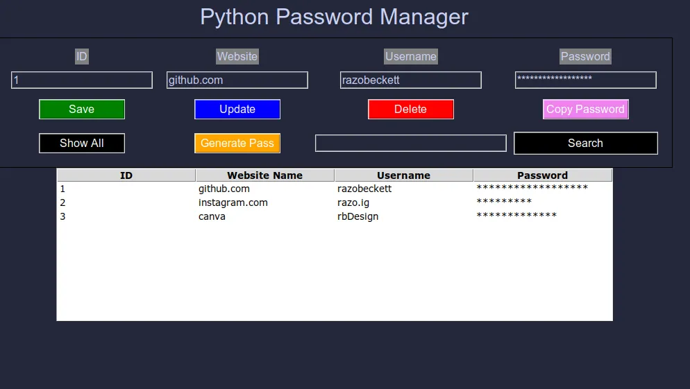
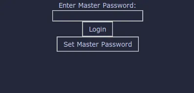
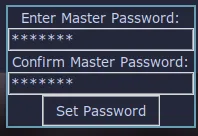
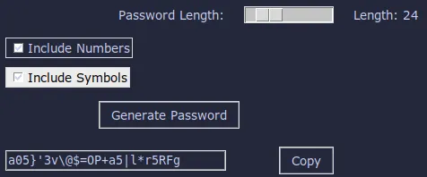

# Python Password Manager
A simple password manager written in Python. The passwords are stored in a sqlite3 database.

## Features
- Add, delete, and view passwords
- Generate random passwords
- Copy passwords to clipboard
- Search for passwords

## Usage
```bash
python3 main.py
```

## Screenshots

|Main Screen|Copy Password Pop-up|
|---|---|
|||
|Master Login Screen|Master Password Setup|
|| |
|Password Generator|
||

> [!NOTE]
> The password manager is built using Python with Tkinter. Since Tkinter supports Qt, the appearance of the application may vary depending on your desktop environment. The screenshots reflect the color scheme I have set for my system.

## License
[Mozilla Public License, Version 2.0](LICENSE)
